# Meteor环境安装指南

1. 安装配置Ubuntu14.04
-------

首先安装Ubuntu主机，我们推荐采用虚拟机开发，我们在Vmware里安装Ubuntu14.04，用户名是meteor

注意，安装时需要下载的文件尽量skip掉，安装完毕以后可以在比较快的镜像里面下载

2. 启用root用户
-------
 
可以通过设置root密码的方式来启用root用户

	$ sudo passwd root

设置完以后可以试一下su指令，进入root模式，后面很多操作采用root操作

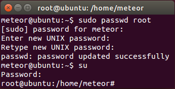

3. 配置源并更新
-------

安装以后通过编辑/etc/apt/sources.list配置源

	meteor@ubuntu:~$ sudo gedit /etc/apt/sources.list

对于清华校内的用户，可以采用tuna的源，可以节省对外流量

	deb http://mirrors.i.tuna.tsinghua.edu.cn/ubuntu trusty main restricted universe multiverse
	deb http://mirrors.i.tuna.tsinghua.edu.cn/ubuntu trusty-security main restricted universe multiverse
	deb http://mirrors.i.tuna.tsinghua.edu.cn/ubuntu trusty-updates main restricted universe multiverse
	deb http://mirrors.i.tuna.tsinghua.edu.cn/ubuntu trusty-proposed main restricted universe multiverse
	deb http://mirrors.i.tuna.tsinghua.edu.cn/ubuntu trusty-backports main restricted universe multiverse
	deb-src http://mirrors.i.tuna.tsinghua.edu.cn/ubuntu trusty main restricted universe multiverse
	deb-src http://mirrors.i.tuna.tsinghua.edu.cn/ubuntu trusty-security main restricted universe multiverse
	deb-src http://mirrors.i.tuna.tsinghua.edu.cn/ubuntu trusty-updates main restricted universe multiverse
	deb-src http://mirrors.i.tuna.tsinghua.edu.cn/ubuntu trusty-proposed main restricted universe multiverse
	deb-src http://mirrors.i.tuna.tsinghua.edu.cn/ubuntu trusty-backports main restricted universe multiverse

对于北京公网用户而言，经测试，最快的ubuntu镜像是http://mirrors.yun-idc.com/ubuntu/的镜像

	deb http://mirrors.yun-idc.com/ubuntu/ trusty main restricted universe multiverse
	deb http://mirrors.yun-idc.com/ubuntu/ trusty-security main restricted universe multiverse
	deb http://mirrors.yun-idc.com/ubuntu/ trusty-updates main restricted universe multiverse
	deb http://mirrors.yun-idc.com/ubuntu/ trusty-proposed main restricted universe multiverse
	deb http://mirrors.yun-idc.com/ubuntu/ trusty-backports main restricted universe multiverse
	deb-src http://mirrors.yun-idc.com/ubuntu/ trusty main restricted universe multiverse
	deb-src http://mirrors.yun-idc.com/ubuntu/ trusty-security main restricted universe multiverse
	deb-src http://mirrors.yun-idc.com/ubuntu/ trusty-updates main restricted universe multiverse
	deb-src http://mirrors.yun-idc.com/ubuntu/ trusty-proposed main restricted universe multiverse
	deb-src http://mirrors.yun-idc.com/ubuntu/ trusty-backports main restricted universe multiverse

随后执行更新指令
	
	meteor@ubuntu:~$ sudo apt-get update -y 
	meteor@ubuntu:~$ sudo apt-get upgrade -y 

4.配置openssh和root的登录
-------

	meteor@ubuntu:~$ sudo apt-get install openssh-client openssh-server git -y
	meteor@ubuntu:~$ ssh-keygen -t rsa
	meteor@ubuntu:~$ su
	root@ubuntu:/home/meteor# cd
	root@ubuntu:~# mkdir .ssh
	root@ubuntu:~# cp /home/meteor/.ssh/id_rsa.pub /root/.ssh/authorized_keys 

安装openssh并生成sshkey，  
然后再进入root用户的home，创建/root/.ssh/  
最后将客户端的id_rsa.pub内容复制到 /root/.ssh/authorized_keys 内，以达到权限认证目的

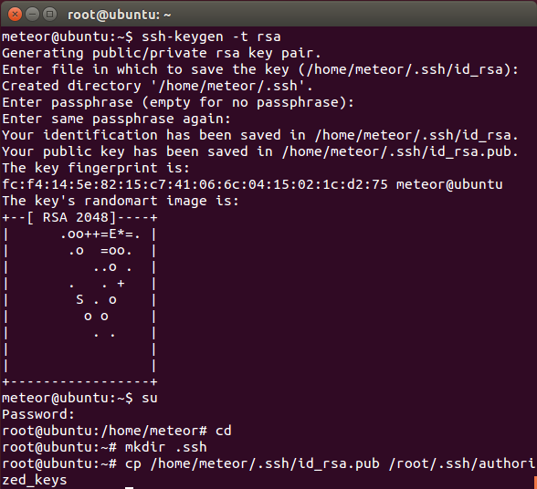

然后再退出root用户，在重启ssh服务，最后使用root用户连接到本地的ssh里面

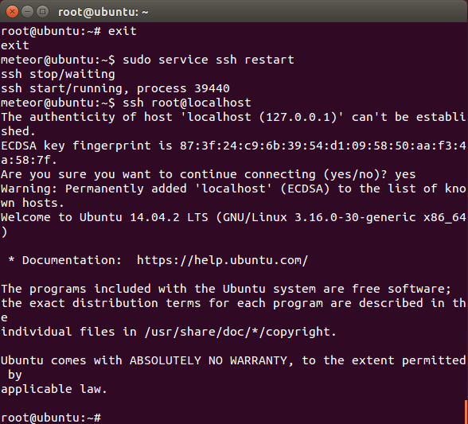

5. 配置GitHub账户，并clone本项目
-------

首先登陆github，再进入如下界面
https://github.com/settings/ssh

点击右上角的Add SSH key

然后执行

	meteor@ubuntu:~$ gedit .ssh/id_rsa.pub

复制所有内容，黏贴到页面里

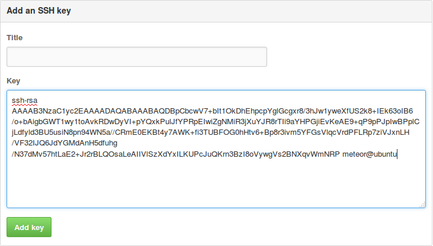

然后在命令行执行如下指令下载部署用项目，项目有点大，稍微等一段时间

	meteor@ubuntu:~$ git clone git@github.com:wmzhai/setup-meteor-machine.git

6. 安装phantomjs
-------

切换目录，执行如下脚本

	meteor@ubuntu:~/setup-meteor-machine/scripts$ cd ~/setup-meteor-machine/scripts
	meteor@ubuntu:~/setup-meteor-machine/scripts$ ./install-phantomjs.sh

执行完毕成功了会显示版本号1.9.8

7. 安装nodejs
-------

执行如下脚本

	meteor@ubuntu:~/setup-meteor-machine/scripts$ ./install-node.sh 

执行完毕成功了会nodejs和npm的版本号

8. 安装mongodb v3
-------

确保网络畅通，执行如下脚本 
	
	meteor@ubuntu:~/setup-meteor-machine/scripts$ ./install-mongodb.sh

这一步需要从网上下载文件，需要等一段时间，安装完毕以后输入如下指令验证，一切正常的话会进入mongodb的shell

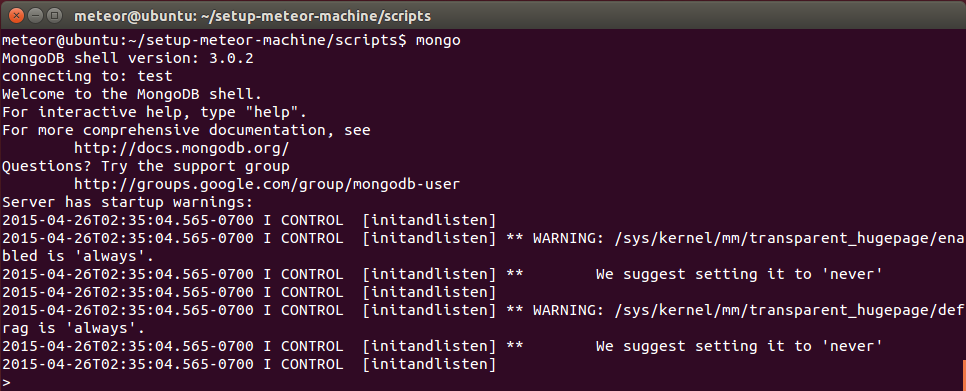

9. 安装meteor
-------

切换回home路径，执行如下指令安装meteor并新建项目运行

	meteor@ubuntu:~$ curl https://install.meteor.com/ | sh

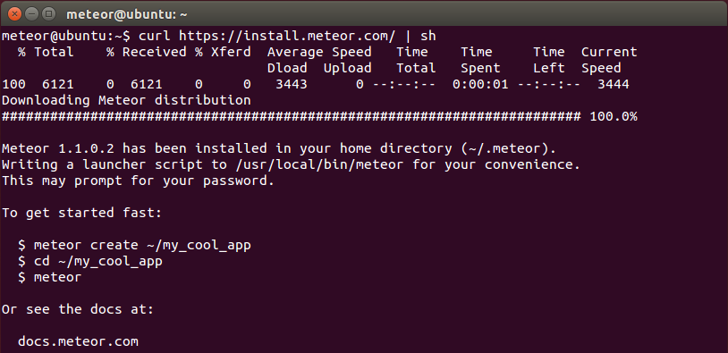

	meteor@ubuntu:~$ meteor create hello
	meteor@ubuntu:~$ cd hello
	meteor@ubuntu:~$ meteor 

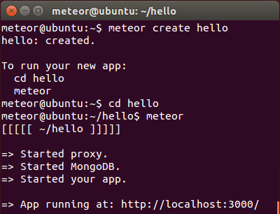

用浏览器进入http://localhost:3000/ 验证项目正常运行

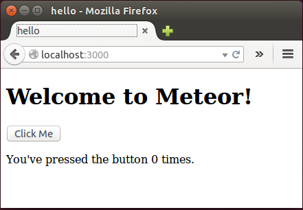

10. 安装mup
-------

Ctrl-C退出服务器运行

	meteor@ubuntu:~/hello$ sudo npm install -g mup

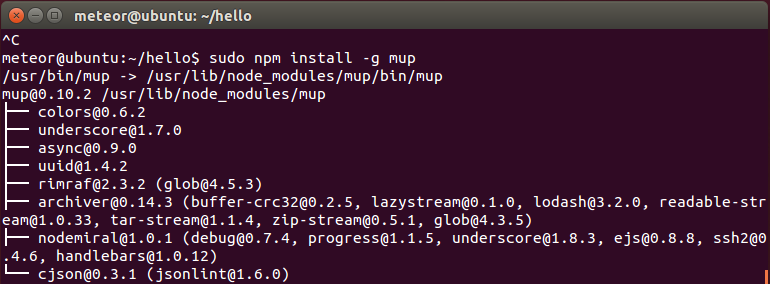

11. mup init
-------

执行mup init生成配置文件

	meteor@ubuntu:~/hello$ mup init

然后编辑mup.json如下

	{
	  // Server authentication info
	  "servers": [
	    {
	      "host": "localhost",
	      "username": "root",
	      "pem": "~/.ssh/id_rsa"
	    }
	  ],
	
	  // Install MongoDB in the server, does not destroy local MongoDB on future setup
	  "setupMongo": false,
	
	  // WARNING: Node.js is required! Only skip if you already have Node.js installed on server.
	  "setupNode": false,
	
	  // WARNING: If nodeVersion omitted will setup 0.10.36 by default. Do not use v, only version number.
	  "nodeVersion": "0.10.36",
	
	  // Install PhantomJS in the server
	  "setupPhantom": false,
	
	  // Application name (No spaces)
	  "appName": "hello",
	
	  // Location of app (local directory)
	  "app": ".",
	
	  // Configure environment
	  "env": {
	    "ROOT_URL": "http://localhost"
	  },
	
	  // Meteor Up checks if the app comes online just after the deployment
	  // before mup checks that, it will wait for no. of seconds configured below
	  "deployCheckWaitTime": 15
	}

12. mup setup安装环境
-------

再执行mup setup，这个步骤有点久，需要等一段时间

	meteor@ubuntu:~/hello$ mup setup

13. mup deploy部署
-------

	meteor@ubuntu:~/hello$ mup deploy

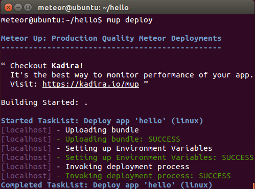

项目是被安装到/opt/hello目录下，可以切换目录进去看看

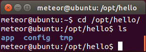

14. 浏览部署结果
-------

最后在浏览器里面打开http://localhost验证是否部署正常

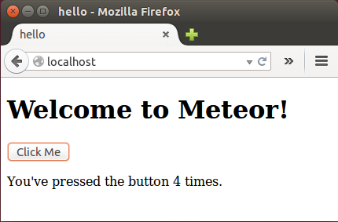

